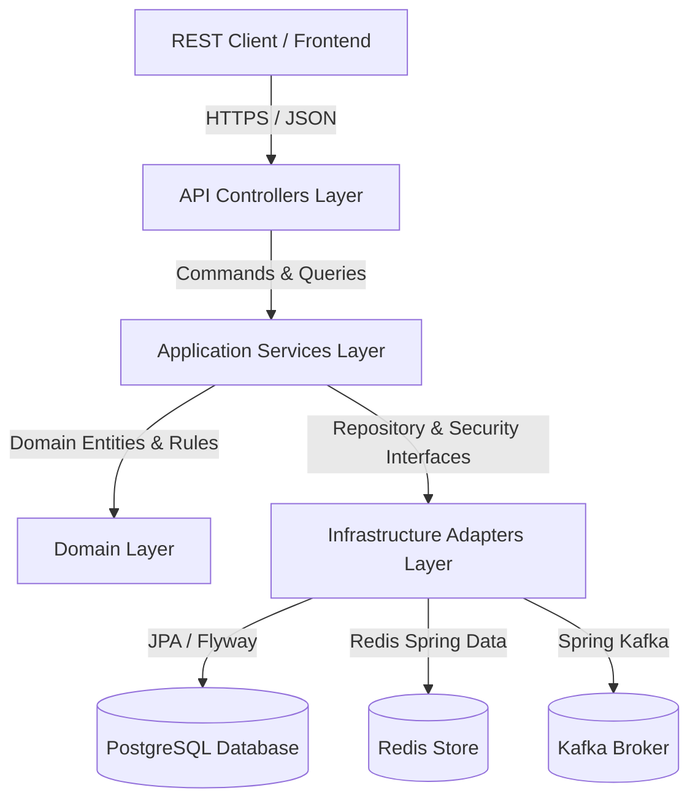

# Aegis Sentinel API & Architecture Specification

---

## 1. Architectural Overview

Aegis Sentinel follows **Clean Architecture** and **Domain-Driven Design (DDD)** principles to separate business core logic from infrastructure details and framework adapters.



---

## 2. API Versioning & Routing Standards

All API endpoints follow explicit URI path versioning:

```
/api/aegis/{version}/{domain}/{resource}
```

### Conventions:
- **Base Version**: `/api/aegis/v1`
- **Authentication & Identity Domain**: `/api/aegis/v1/auth`
- **MFA Management Domain**: `/api/aegis/v1/auth/mfa`
- **RBAC & Multi-Tenancy Test Suite**: `/api/aegis/v1/rbac-test`

---

## 3. Authentication & Token Management Lifecycle

Aegis Sentinel provides a dual-token security architecture:

1. **Access Token (Short-lived)**:
   - Type: `JWT` (HMAC-SHA256 signed)
   - Expiration: `15 minutes`
   - Header format: `Authorization: Bearer <token>`
   - Payload claims: `sub` (User ID), `email`, `token_type` (`access`), `org_id`, `workspace_id`, `roles`, `permissions`, `amr` (Authentication Methods References, e.g. `["pwd"]`, `["pwd", "totp"]`, `["pwd", "mfa_recovery"]`, `["oauth"]`).

2. **Refresh Token (Long-lived & Cryptographically Hashed)**:
   - Expiration: `7 days`
   - Security: Hashed in PostgreSQL database using **SHA-256** (`Sha256RefreshTokenHasher`) to prevent plaintext token leaks.
   - Rotation: Rotated automatically upon every `/api/aegis/v1/auth/refresh` request.

---

## 4. OAuth2 Provider Integration & Account Linking

Aegis Sentinel supports federated authentication (e.g. Google OAuth2):

- **OAuth Authorization Entry**: `/oauth2/authorization/google`
- **Success Handler**: `OAuth2SuccessHandler` validates federated identity and issues Aegis access/refresh tokens (`amr: ["oauth"]`). Google identities automatically establish email verification (`email_verified = true`).
- **Account Linking**: `/api/aegis/v1/auth/link-account` allows binding a third-party `providerSubject` ID to an existing password user account after credential verification.

---

## 5. Identity Assurance & Multi-Factor Authentication (MFA)

Aegis Sentinel enforces identity assurance through email verification and TOTP-based Multi-Factor Authentication:

```text
                    LOCAL REGISTER
                         │
                         ▼
                  Create User
                         │
                         ▼
               email_verified = false
                         │
                         ▼
               Send verification email
                         │
                         ▼
                 Verify email
                         │
                         ▼
               email_verified = true
                         │
                         ▼
                    LOGIN
                         │
              ┌──────────┴──────────┐
              │                     │
          MFA OFF                MFA ON
              │                     │
              ▼                     ▼
        Issue JWTs             MFA Challenge
                                    │
                                    ▼
                              6-digit TOTP
                                    │
                                    ▼
                              Verify TOTP
                                    │
                                    ▼
                               Issue JWTs
```

### 5.1 Email Verification
- **Local Account Registration**: `/api/aegis/v1/auth/register` creates user accounts with `email_verified = false` and generates a 24-hour verification token.
- **Verification**: `POST /api/aegis/v1/auth/verify-email` consumes raw verification tokens and activates user email ownership.
- **Resend**: `POST /api/aegis/v1/auth/resend-verification` implements anti-account enumeration semantics by returning generic response messages.

### 5.2 RFC 6238 TOTP Engine & MFA Enrollment
- **TOTP Standards**: 6-digit codes, 30-second time step, SHA1 HMAC algorithm, and clock skew tolerance.
- **At-Rest Encryption**: MFA secret keys are encrypted in PostgreSQL (`mfa_credentials.encrypted_secret`) using **AES-256 GCM** (`SecretEncryptionService`).
- **Enrollment**:
  - `POST /api/aegis/v1/auth/mfa/setup`: Generates secret and returns `otpauth://totp/...` URI for authenticator QR code scanning.
  - `POST /api/aegis/v1/auth/mfa/verify-setup`: Confirms initial TOTP code, enables MFA (`is_mfa_enabled = true`), and returns 10 single-use recovery codes.

### 5.3 MFA Login Challenge & Recovery
- **MFA Login Challenge**: Password verification on MFA-enabled accounts returns an `MFA_REQUIRED` status with a 5-minute `challengeId`.
- **TOTP Verification**: `POST /api/aegis/v1/auth/mfa/verify` verifies 6-digit TOTP codes for active challenges and issues JWT access/refresh tokens (`amr: ["pwd", "totp"]`).
- **Recovery Code Verification**: `POST /api/aegis/v1/auth/mfa/recovery` consumes single-use recovery codes (`mfa_recovery_codes`) and issues JWT tokens (`amr: ["pwd", "mfa_recovery"]`).

### 5.4 MFA Management
- `GET /api/aegis/v1/auth/mfa/status`: Retrieves current MFA status.
- `POST /api/aegis/v1/auth/mfa/disable`: Disables MFA after password + TOTP verification.
- `POST /api/aegis/v1/auth/mfa/regenerate-recovery-codes`: Generates 10 new recovery codes after TOTP verification.

---

## 6. Multi-Tenancy Architecture

Multi-tenancy isolation is enforced at the request level:

- **Hierarchy**: `Organization` (Level 1 Tenant) $\rightarrow$ `Workspace` (Level 2 Sub-tenant).
- **Header Enforcement**:
  - `X-Organization-Id`: UUID string specifying active organization tenant context.
  - `X-Workspace-Id`: UUID string specifying active workspace context.
- **Context Injection**: `TenantResolverFilter` extracts request headers and registers tenant context into thread-local `TenantContext`.

---

## 7. Role-Based Access Control (RBAC) & Fine-Grained Authorization

Authorization is checked declaratively via Spring Security `@PreAuthorize`:

- **Role Authorities**: e.g., `ROLE_ORG_ADMIN`, `ROLE_WORKSPACE_ADMIN`, `ROLE_ANALYST`.
- **Fine-Grained Permissions**: e.g., `alert:read`, `alert:write`, `workflow:execute`, `system:super-admin`.
- **Tenant Evaluator**: `@tenantSecurity.hasPermission(#orgId, 'alert:read')` and `@tenantSecurity.hasWorkspacePermission(#orgId, #wsId, 'alert:read')` guarantee that users cannot access resources outside their authorized organization or workspace context.

---

## 8. Standard Error Response Schema

All errors produce a consistent JSON payload defined by `ApiErrorResponse`:

```json
{
  "status": 400,
  "error": "Bad Request",
  "message": "Validation failed for request payload",
  "path": "/api/aegis/v1/auth/register",
  "timestamp": "2026-08-18T01:00:00Z",
  "fieldErrors": {
    "email": "must not be blank"
  }
}
```

### HTTP Error Code Mapping:
- **`400 Bad Request`**: Validation errors (`MethodArgumentNotValidException`, `ConstraintViolationException`), malformed JSON payload.
- **`401 Unauthorized`**: Missing, expired, or invalid JWT access token / refresh token / MFA challenge.
- **`403 Forbidden`**: Insufficient RBAC roles, ungranted permissions, or cross-tenant access violation (`AccessDeniedException`).
- **`409 Conflict`**: Duplicate account registration or already-linked OAuth account.
- **`429 Too Many Requests`**: Rate limit exceeded for sensitive authentication endpoints.
- **`500 Internal Server Error`**: Unexpected system exceptions.

---

## 9. Rate Limiting & Security Audit Logging

- **Rate Limiting**: `RateLimitingFilter` prevents brute-force login and API abuse by enforcing request rate limits on sensitive endpoints (`/login`, `/register`, `/refresh`, `/link-account`, `/verify-email`, `/resend-verification`, `/mfa/verify`, `/mfa/recovery`).
- **Security Audit Logging**: `SecurityAuditLogger` publishes structured `SecurityAuditEvent` logs for authentication successes, login failures, email verification events, MFA enrollment, MFA challenges, recovery code usage, token revocations, and access denial events. Sensitive secrets, TOTP codes, raw tokens, and passwords are never logged in plaintext.
