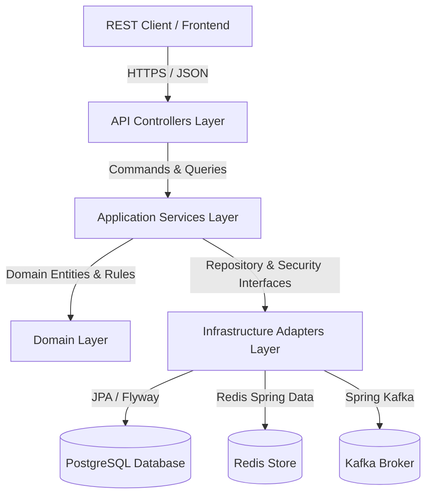

# Aegis Sentinel API & Architecture Specification

---

## 1. Architectural Overview

Aegis Sentinel follows **Clean Architecture** and **Domain-Driven Design (DDD)** principles to separate business core logic from infrastructure details and framework adapters.



---

## 2. API Versioning & Routing Standards

All API endpoints follow explicit URI path versioning:

```
/api/aegis/{version}/{domain}/{resource}
```

### Conventions:
- **Base Version**: `/api/aegis/v1`
- **Authentication & Identity Domain**: `/api/aegis/v1/auth`
- **RBAC & Multi-Tenancy Test Suite**: `/api/aegis/v1/rbac-test`

---

## 3. Authentication & Token Management Lifecycle

Aegis Sentinel provides a dual-token security architecture:

1. **Access Token (Short-lived)**:
   - Type: `JWT` (HMAC-SHA256 signed)
   - Expiration: `15 minutes`
   - Header format: `Authorization: Bearer <token>`
   - Payload claims: `sub` (User ID), `email`, `token_type` (`access`), `org_id`, `workspace_id`, `roles`, `permissions`.

2. **Refresh Token (Long-lived & Cryptographically Hashed)**:
   - Expiration: `7 days`
   - Security: Hashed in PostgreSQL database using **SHA-256** (`Sha256RefreshTokenHasher`) to prevent plaintext token leaks.
   - Rotation: Rotated automatically upon every `/api/aegis/v1/auth/refresh` request.

---

## 4. OAuth2 Provider Integration & Account Linking

Aegis Sentinel supports federated authentication (e.g. Google OAuth2):

- **OAuth Authorization Entry**: `/oauth2/authorization/google`
- **Success Handler**: `OAuth2SuccessHandler` validates federated identity and issues Aegis access/refresh tokens.
- **Account Linking**: `/api/aegis/v1/auth/link-account` allows binding a third-party `providerSubject` ID to an existing password user account after credential verification.

---

## 5. Multi-Tenancy Architecture

Multi-tenancy isolation is enforced at the request level:

- **Hierarchy**: `Organization` (Level 1 Tenant) $\rightarrow$ `Workspace` (Level 2 Sub-tenant).
- **Header Enforcement**:
  - `X-Organization-Id`: UUID string specifying active organization tenant context.
  - `X-Workspace-Id`: UUID string specifying active workspace context.
- **Context Injection**: `TenantResolverFilter` extracts request headers and registers tenant context into thread-local `TenantContext`.

---

## 6. Role-Based Access Control (RBAC) & Fine-Grained Authorization

Authorization is checked declaratively via Spring Security `@PreAuthorize`:

- **Role Authorities**: e.g., `ROLE_ORG_ADMIN`, `ROLE_WORKSPACE_ADMIN`, `ROLE_ANALYST`.
- **Fine-Grained Permissions**: e.g., `alert:read`, `alert:write`, `workflow:execute`, `system:super-admin`.
- **Tenant Evaluator**: `@tenantSecurity.hasPermission(#orgId, 'alert:read')` and `@tenantSecurity.hasWorkspacePermission(#orgId, #wsId, 'alert:read')` guarantee that users cannot access resources outside their authorized organization or workspace context.

---

## 7. Standard Error Response Schema

All errors produce a consistent JSON payload defined by `ApiErrorResponse`:

```json
{
  "status": 400,
  "error": "Bad Request",
  "message": "Validation failed for request payload",
  "path": "/api/aegis/v1/auth/register",
  "timestamp": "2026-08-15T01:00:00Z",
  "fieldErrors": {
    "email": "must not be blank"
  }
}
```

### HTTP Error Code Mapping:
- **`400 Bad Request`**: Validation errors (`MethodArgumentNotValidException`, `ConstraintViolationException`), malformed JSON payload.
- **`401 Unauthorized`**: Missing, expired, or invalid JWT access token / refresh token.
- **`403 Forbidden`**: Insufficient RBAC roles, ungranted permissions, or cross-tenant access violation (`AccessDeniedException`).
- **`409 Conflict`**: Duplicate account registration or already-linked OAuth account.
- **`500 Internal Server Error`**: Unexpected system exceptions.

---

## 8. Rate Limiting & Security Audit Logging

- **Rate Limiting**: `RateLimitingFilter` prevents brute-force login and API abuse by enforcing request rate limits per IP / account.
- **Security Audit Logging**: `SecurityAuditLogger` publishes structured `SecurityAuditEvent` logs for authentication successes, login failures, token revocations, and access denial events.
